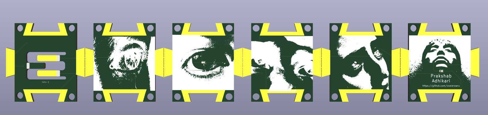
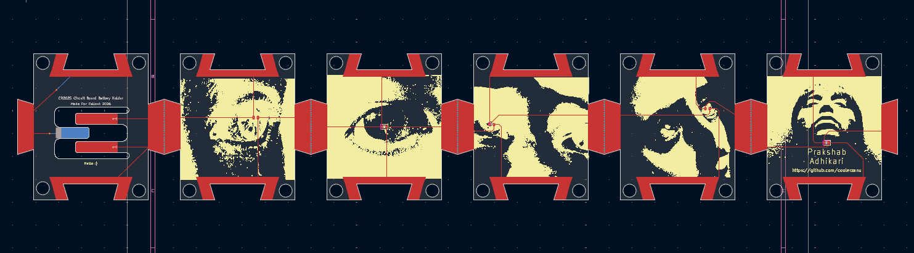

Hello! This is my PCB Card for Fallout!

It is basically a 2D card that can be broken into multiple pieces and then reassembled into a cube! You solder the connections via the prongs and if you insert a coin battery in the slot, it should light up!

There is no schematic as it is very simple LEDS to power. 

Slack Username: Zanu

